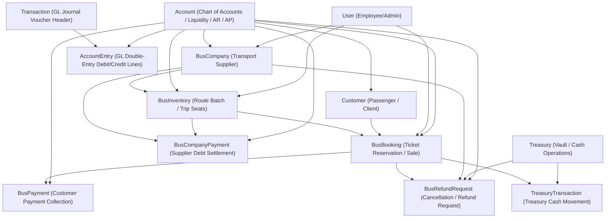

# BUS ACTUAL DATABASE DEPENDENCY GRAPH

Database: `safarakealayna`
Environment: `local`

## 1. Table Statistics & Row Counts

| Table Name | Row Count | Soft Delete Column | Primary Key |
| --- | --- | --- | --- |
| `users` | 2 | NO | `id` |
| `accounts` | 503 | YES (timestamp) | `id` |
| `customers` | 442 | YES (timestamp) | `id` |
| `bus_companies` | 37 | YES (timestamp) | `id` |
| `bus_inventories` | 45 | YES (timestamp) | `id` |
| `bus_bookings` | 425 | YES (timestamp) | `id` |
| `bus_payments` | 21 | YES (timestamp) | `id` |
| `bus_company_payments` | 0 | YES (timestamp) | `id` |
| `bus_refund_requests` | 6 | YES (timestamp) | `id` |
| `treasuries` | 1 | NO | `id` |
| `treasury_transactions` | 0 | NO | `id` |
| `transactions` | 984 | NO | `id` |
| `account_entries` | 2052 | NO | `id` |

---

## 2. Actual Database Foreign Key Relationships

| Child Table | FK Column | Constraint | Parent Table | Parent Column |
| --- | --- | --- | --- | --- |
| `account_entries` | `account_id` | `account_entries_account_id_foreign` | `accounts` | `id` |
| `account_entries` | `transaction_id` | `account_entries_transaction_id_foreign` | `transactions` | `id` |
| `accounts` | `created_by` | `accounts_created_by_foreign` | `users` | `id` |
| `bus_bookings` | `account_id` | `bus_bookings_account_id_foreign` | `accounts` | `id` |
| `bus_bookings` | `created_by` | `bus_bookings_created_by_foreign` | `users` | `id` |
| `bus_bookings` | `customer_id` | `bus_bookings_customer_id_foreign` | `customers` | `id` |
| `bus_bookings` | `employee_id` | `bus_bookings_employee_id_foreign` | `employees` | `id` |
| `bus_bookings` | `inventory_id` | `bus_bookings_inventory_id_foreign` | `bus_inventories` | `id` |
| `bus_bookings` | `transaction_id` | `bus_bookings_transaction_id_foreign` | `transactions` | `id` |
| `bus_companies` | `account_id` | `bus_companies_account_id_foreign` | `accounts` | `id` |
| `bus_companies` | `created_by` | `bus_companies_created_by_foreign` | `users` | `id` |
| `bus_company_payments` | `account_id` | `bus_company_payments_account_id_foreign` | `accounts` | `id` |
| `bus_company_payments` | `company_id` | `bus_company_payments_company_id_foreign` | `bus_companies` | `id` |
| `bus_company_payments` | `created_by` | `bus_company_payments_created_by_foreign` | `users` | `id` |
| `bus_company_payments` | `inventory_id` | `bus_company_payments_inventory_id_foreign` | `bus_inventories` | `id` |
| `bus_company_payments` | `transaction_id` | `bus_company_payments_transaction_id_foreign` | `transactions` | `id` |
| `bus_inventories` | `account_id` | `bus_inventories_account_id_foreign` | `accounts` | `id` |
| `bus_inventories` | `company_id` | `bus_inventories_company_id_foreign` | `bus_companies` | `id` |
| `bus_inventories` | `created_by` | `bus_inventories_created_by_foreign` | `users` | `id` |
| `bus_inventories` | `transaction_id` | `bus_inventories_transaction_id_foreign` | `transactions` | `id` |
| `bus_payments` | `account_id` | `bus_payments_account_id_foreign` | `accounts` | `id` |
| `bus_payments` | `booking_id` | `bus_payments_booking_id_foreign` | `bus_bookings` | `id` |
| `bus_payments` | `created_by` | `bus_payments_created_by_foreign` | `users` | `id` |
| `bus_payments` | `transaction_id` | `bus_payments_transaction_id_foreign` | `transactions` | `id` |
| `bus_refund_requests` | `account_id` | `bus_refund_requests_account_id_foreign` | `accounts` | `id` |
| `bus_refund_requests` | `bus_booking_id` | `bus_refund_requests_bus_booking_id_foreign` | `bus_bookings` | `id` |
| `bus_refund_requests` | `company_id` | `bus_refund_requests_company_id_foreign` | `bus_companies` | `id` |
| `bus_refund_requests` | `created_by` | `bus_refund_requests_created_by_foreign` | `users` | `id` |
| `bus_refund_requests` | `transaction_id` | `bus_refund_requests_transaction_id_foreign` | `transactions` | `id` |
| `bus_refund_requests` | `treasury_id` | `bus_refund_requests_treasury_id_foreign` | `treasuries` | `id` |
| `customers` | `account_id` | `customers_account_id_foreign` | `accounts` | `id` |
| `customers` | `created_by` | `customers_created_by_foreign` | `users` | `id` |
| `transactions` | `approval_workflow_id` | `transactions_approval_workflow_id_foreign` | `approval_workflows` | `id` |
| `transactions` | `created_by` | `transactions_created_by_foreign` | `users` | `id` |
| `transactions` | `from_account_id` | `transactions_from_account_id_foreign` | `accounts` | `id` |
| `transactions` | `program_id` | `transactions_program_id_foreign` | `programs` | `id` |
| `transactions` | `to_account_id` | `transactions_to_account_id_foreign` | `accounts` | `id` |
| `treasury_transactions` | `account_id` | `treasury_transactions_account_id_foreign` | `accounts` | `id` |
| `treasury_transactions` | `bus_booking_id` | `treasury_transactions_bus_booking_id_foreign` | `bus_bookings` | `id` |
| `treasury_transactions` | `flight_booking_id` | `treasury_transactions_flight_booking_id_foreign` | `flight_bookings` | `id` |
| `treasury_transactions` | `hajj_umra_booking_id` | `treasury_transactions_hajj_umra_booking_id_foreign` | `hajj_umra_bookings` | `id` |
| `treasury_transactions` | `ledger_transaction_id` | `treasury_transactions_ledger_transaction_id_foreign` | `transactions` | `id` |
| `treasury_transactions` | `refund_request_id` | `treasury_transactions_refund_request_id_foreign` | `refund_requests` | `id` |
| `treasury_transactions` | `treasury_id` | `treasury_transactions_treasury_id_foreign` | `treasuries` | `id` |
| `treasury_transactions` | `visa_booking_id` | `treasury_transactions_visa_booking_id_foreign` | `visa_bookings` | `id` |

---

## 3. Bus Module Relationship Map (Mermaid Visual Graph)

---

## 4. Entity Dependency Creation Hierarchy

To execute a complete Bus transaction lifecycle from scratch, entities must be instantiated in this exact order:

1. **System Prerequisite Level**: `User` (Admin / Operator), `Treasury` (Agency Cash Vault), `Account` (System Clearing & Liquidity Accounts)
2. **Supplier Level**: `BusCompany` (linked to supplier payable `Account`)
3. **Inventory Level**: `BusInventory` (linked to `BusCompany` and optional liquidity `Account` for cash purchases)
4. **Customer Level**: `Customer` (linked to client receivable `Account`)
5. **Booking Level**: `BusBooking` (locks seats in `BusInventory`, posts AR sale to `Account`, creates journal `Transaction` and `AccountEntry` lines)
6. **Payment Level**: `BusPayment` (transfers cash from Customer AR `Account` to Vault `Account`, records `TreasuryTransaction`)
7. **Refund & Cancellation Level**: `BusRefundRequest` (restores `BusInventory` tickets, reverses ledger entries, transfers cash from `Treasury` / `Account`)
8. **Supplier Settlement Level**: `BusCompanyPayment` (pays `BusCompany` payable debt from Vault `Account`)
