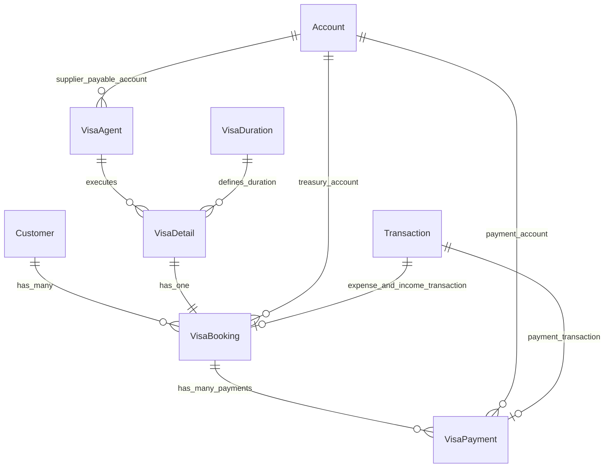

# VISA MODEL RELATIONSHIP MAP

## Entity Relationships

```mermaid
erDiagram
    Customer ||--o{ VisaBooking : has_many
    VisaDetail ||--|| VisaBooking : has_one
    VisaAgent ||--o{ VisaDetail : executes
    VisaDuration ||--o{ VisaDetail : defines_duration
    VisaBooking ||--o{ VisaPayment : has_many_payments
    Account ||--o{ VisaBooking : treasury_account
    Account ||--o{ VisaPayment : payment_account
    Account ||--o{ VisaAgent : supplier_payable_account
    Transaction ||--o| VisaBooking : expense_and_income_transaction
    Transaction ||--o| VisaPayment : payment_transaction
```
